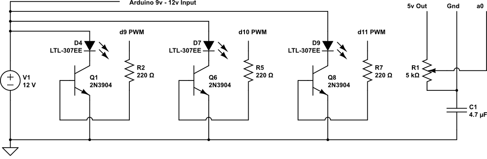

# Smooth Color Fading Loop for Ultra Bright RGB LEDs

This a script used in conjunction with a custom shield I built for Arduino. The schematic for the shield that goes along with this code is located at the link here: [https://www.circuitlab.com/circuit/f48fgf/arduino-rgb-led-rainbow-fade/](https://www.circuitlab.com/circuit/f48fgf/arduino-rgb-led-rainbow-fade/) or below as PNG:

Maintained by: hello@jonathangrover.com

Github: http://github.com/jongrover

Twitter: http://twitter.com/jongrover

Instagram: http://instagram.com/jonathangrover